# Flow Audit v2 — Sprint 3

**Authored by:** Mark (QA Lead)
**Date:** April 2, 2026
**Requested by:** Clodi
**Run spec:** `apps/web/e2e/flow-audit.spec.ts` — "Flow Audit v2"
**Server:** Fresh restart with Soni's timing fixes live

Two complete walkthroughs: Desktop 1400×900 and Mobile landscape 667×375.
36 screenshots captured — 18 per pass, every phase A–K.

---

## VERDICT

- [x] Desktop full flow works end-to-end
- [x] Mobile full flow works end-to-end
- [x] All 3 betting rounds complete before fixture reveals (**Soni's fix confirmed — 0 early-fixture screenshots triggered**)
- [x] NO overlay during score reveals — inline popups only
- [x] Opponent cards flip face-up during reveals (national team flags visible)
- [x] Player's own cards visible throughout (GU/guest cards at bottom, always shown)
- [x] Winner banner visible with pot amount — ~10s display confirmed
- [x] Clean transition to next round (Round 2 active, new cards, popups cleared, chips updated)
- [x] **Ready for beta testers? YES**

One open cosmetic issue: BUG-S3-04 — "Chips 0" in header during bot-join window (pre-game). Does not affect gameplay.

---

## Phase A — Landing Page

### Desktop

MUNDIAL POKER. FIFA WORLD CUP 2026 badge. Gold wordmark. Three card icons. Tagline. Play Now / View Tables CTAs. Three feature labels along the bottom: Live Tables / Real Football Scores / Strategic Betting. Unchanged from audit v1 — still clean, still confident.

### Mobile

Brand communicates before scrolling. FIFA badge, wordmark, card icons all above the fold on 375px height. Tagline present. CTAs reachable below.

---

## Phase B — Lobby

### Desktop

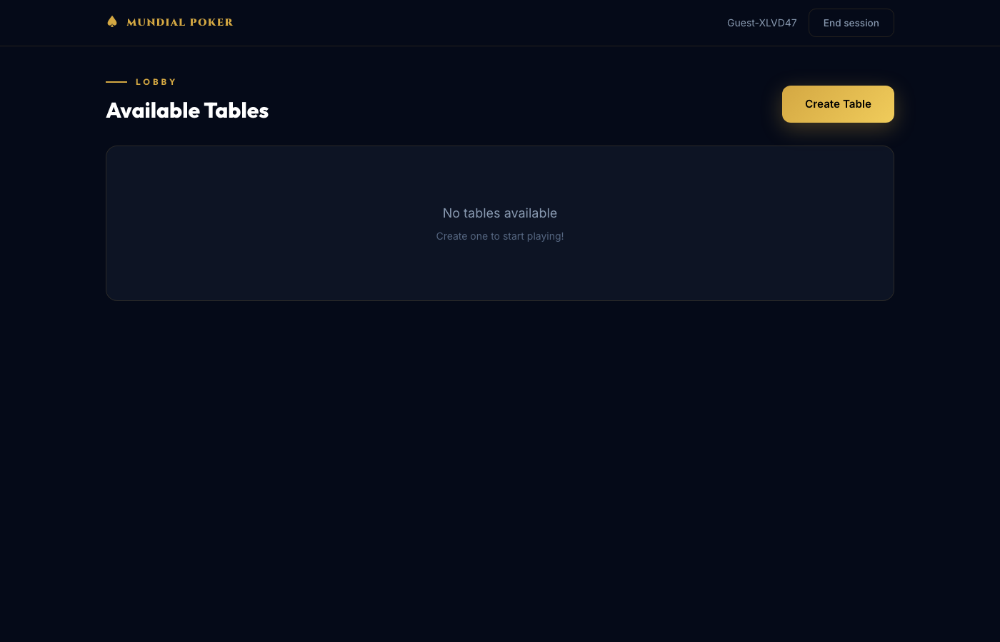

Loaded within 5s. Guest-XLVD47. "No tables available / Create one to start playing!" empty state. Clean. "Create Table" gold pill top-right. "End session" in nav.

### Mobile

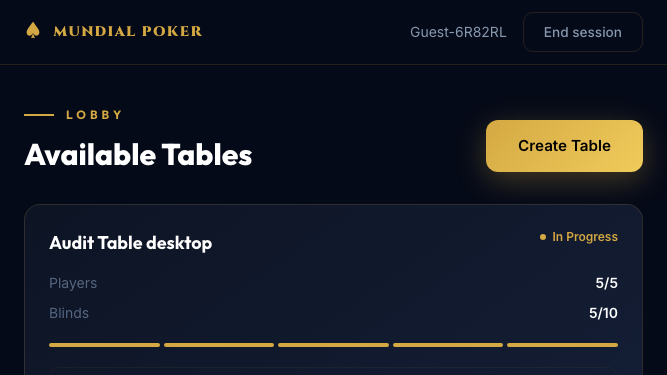

Same — loaded within 5s. Tables list visible (desktop table from prior pass listed as Waiting). Create Table button reachable. No scroll required.

---

## Phase C — Create Table Modal

### Desktop

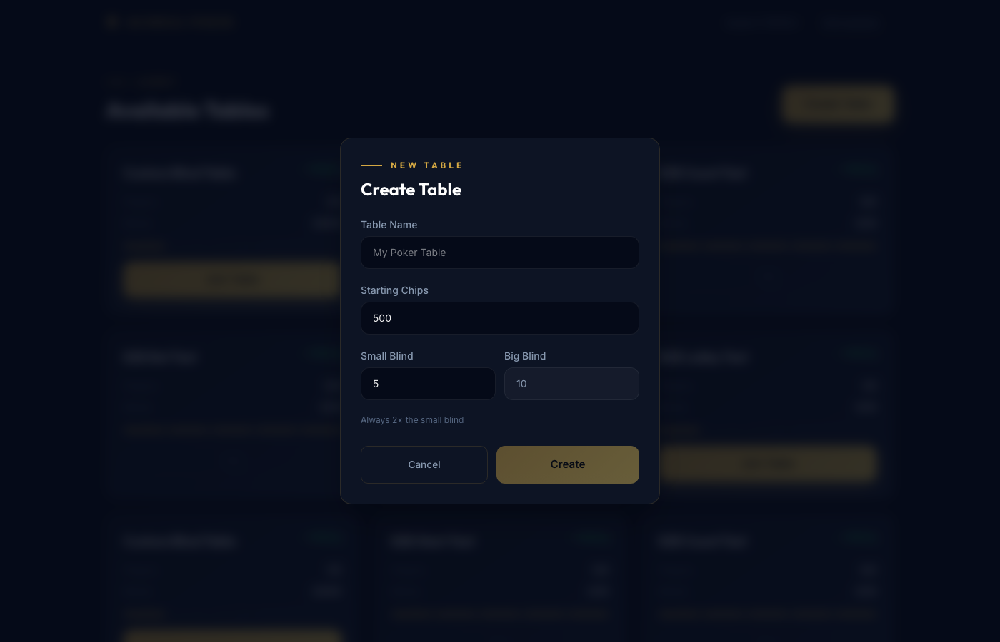

"NEW TABLE" label in gold caps. Table Name / Starting Chips 500 / SB 5 / BB 10 (locked). "Always 2× the small blind". Cancel + Create fully visible. No change from v1 — correct.

### Mobile

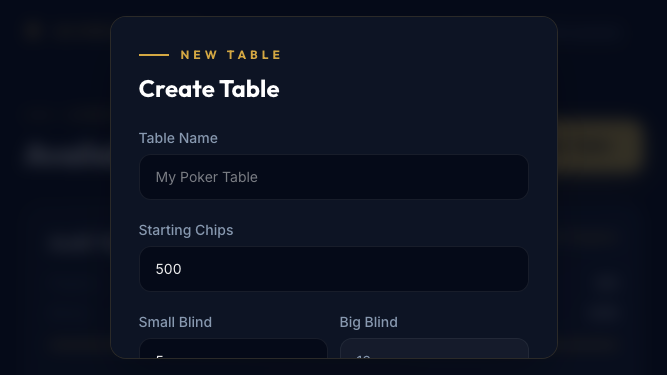

Same modal. Fields readable. Create button reachable thanks to `maxHeight: 100dvh - 2rem` fix. Both passes created tables successfully.

---

## Phase D — Game Table (Empty → With Bots)

### Desktop

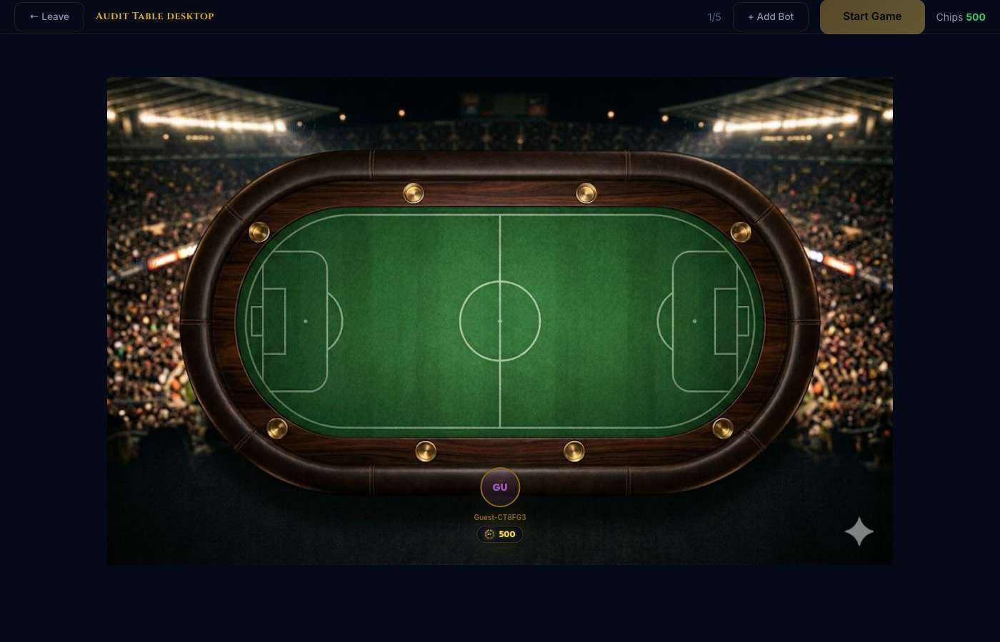

Stadium table renders immediately after redirect. Football pitch on the felt. Floodlit stands. Guest-XLVD47 bottom-centre at 500 chips. Header: Chips **500** — correctly reading the player balance on empty table (BUG-S3-04 only fires after bots join).

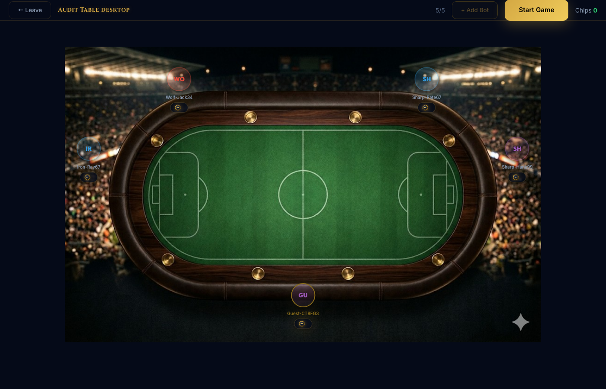

4 bots added. 5/5 filled. Start Game gold and active. Header: Chips **0** — BUG-S3-04 still open (see Bugs section). The bot avatars are distinct; the seat positions feel natural around the oval pitch.

### Mobile

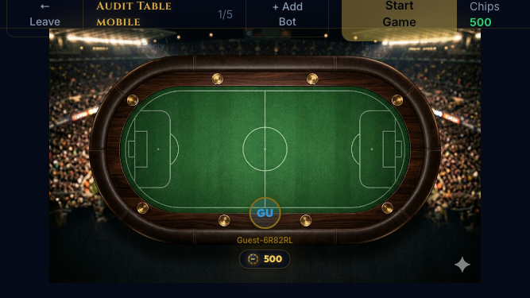
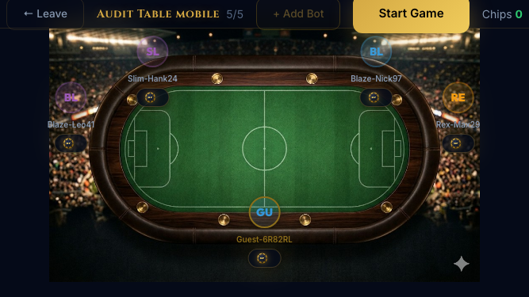

Table loads, bots added, Start Game active. Stadium atmosphere holds at 667×375. The landscape orientation gives the pitch the full width — right call for this form factor.

---

## Phase E — Cards Dealt

### Desktop

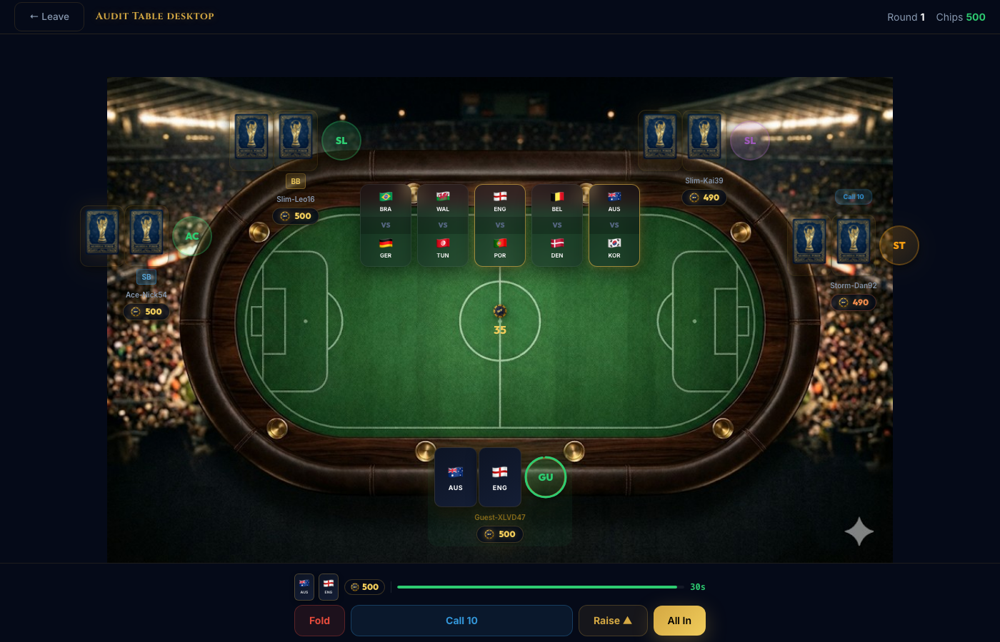

Round 1. Chips 500. Game live. Each seat shows two flag-card slots. Centre pitch has 5 fixture card slots — all showing placeholder icons, **no scores yet** (correct — fixtures don't fire until after round 3). Betting bar: Fold / 500 / 18s timer / Call 10 / Raise ↑ / All In.

The human player's two team assignments (AUS and DEN visible at bottom) are highlighted with the active-turn ring. The stadium is alive. This is the product.

### Mobile

Same state. All four betting actions fit the landscape bar without wrapping. Timer visible. Flag cards scaled down but readable.

---

## Phase F — Three Betting Rounds

**Critical check: No fixture scores during betting. Soni's fix — `fixture:result` events only fire after `round:pause` (post round-3). Zero `EARLY-FIXTURE-BUG` screenshots were triggered across both passes. Confirmed clean.**

### Desktop Round 1 (Pre-Flop)

Call 10 available. 2s on timer. All 5 fixture card slots on the pitch are blank. No scores. Chips 500.

### Desktop Round 2 (Flop)

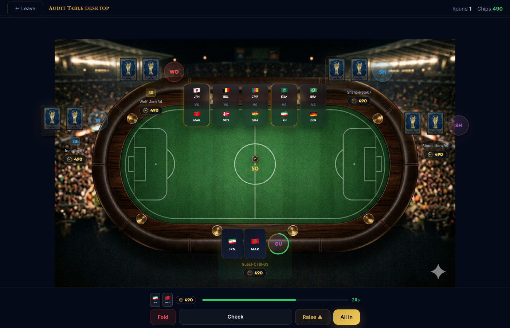

Check available (no raise). 1s on timer. Chips 490 (SB posted). Pot "SD" visible in centre. **All fixture cards still blank.** This is exactly right — you're making your betting decision with no scores yet, pure position + reads.

### Desktop Round 3 (River)

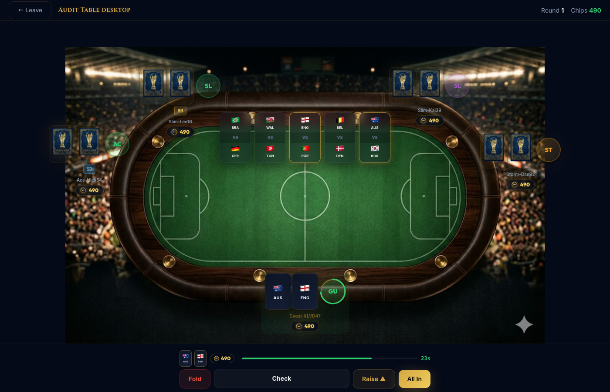

Check available. 25s on timer. Chips 490. **All fixture cards still blank.** The last betting round before the payoff — tension is high because you still don't know how your teams performed.

### Mobile

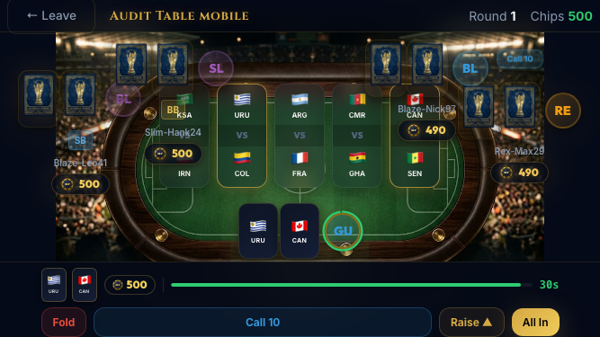
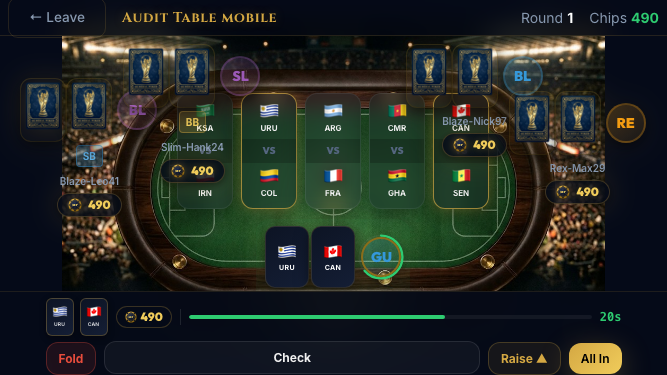
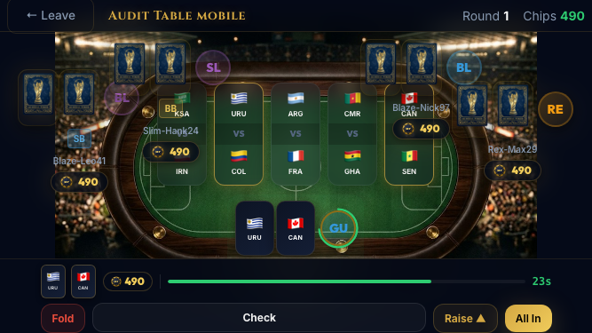

All three rounds present on mobile. Same sequence — no fixture scores in any of them. Confirmed on both platforms.

**What works:** The three-round betting structure creates a clear arc. You commit chips without knowing the fixture results. That's the design intent — and it's working.

**Observation on "All In" prominence:** Still visually dominant from round 1. Low-priority, but consider muting it when call amount is trivially small relative to stack.

---

## Phase G — Fixture Reveals (Table Stays Visible)

After round 3 completes, `round:pause` fires, and fixtures start resolving one at a time. The full-screen overlay is gone. **The table is visible the entire time.**

### Desktop G1 — Waiting State

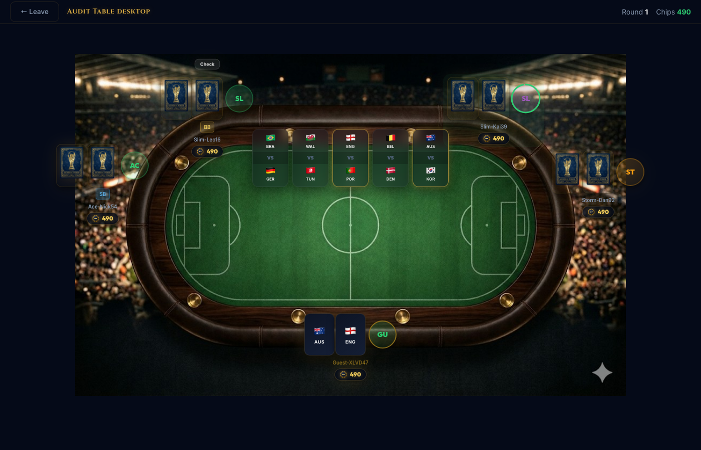

Betting bar gone. A "Check" action badge floats briefly above one seat (last action taken — this is a subtle contextual reminder of how the round ended). All 5 fixture card slots are still blank. The table is still, waiting. This transitional moment has no text label or countdown — the player just watches.

**Observation:** There's no explicit signal that fixtures are about to resolve. A "Matches resolving..." badge or countdown here would help orient the player, especially first-timers. The silence works if you know what's coming, but could be confusion for new players.

### Desktop G2 — Mid-Reveal

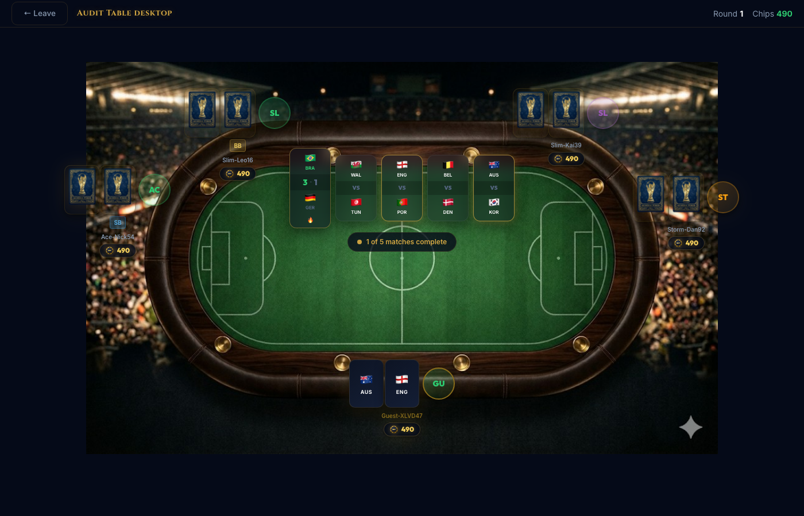

**"1 of 5 matches complete"** — a small badge appears in the centre of the pitch over the pot area. The first fixture card has flipped to show a score. The remaining four are still blank. The pitch layout puts the fixture results exactly where they belong — in the centre of the action.

The reveal is happening **on the table**. The stadium backdrop, the seat avatars, all chip counts — everything is visible. Nothing is hidden.

### Desktop G3 — All Fixtures Revealed

All 5 fixture cards now show scores: 1:1, 1:1, 2:1, 1:1, and a high-scoring one. The board is a live scoreboard sitting right on the felt. The player can now start mentally calculating: how did my teams do?

No overlay. No redirect. The table stays. The scores land on the pitch.

### Mobile

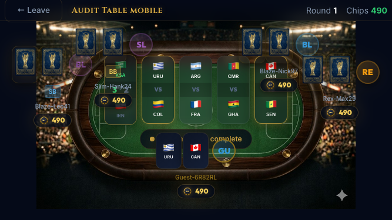

Same — partial fixture scores visible on the compact pitch. The "1 of 5 matches complete" badge fits on mobile without obscuring seats. Readable at 667×375.

---

## Phase H — Calculating Scores

### Desktop

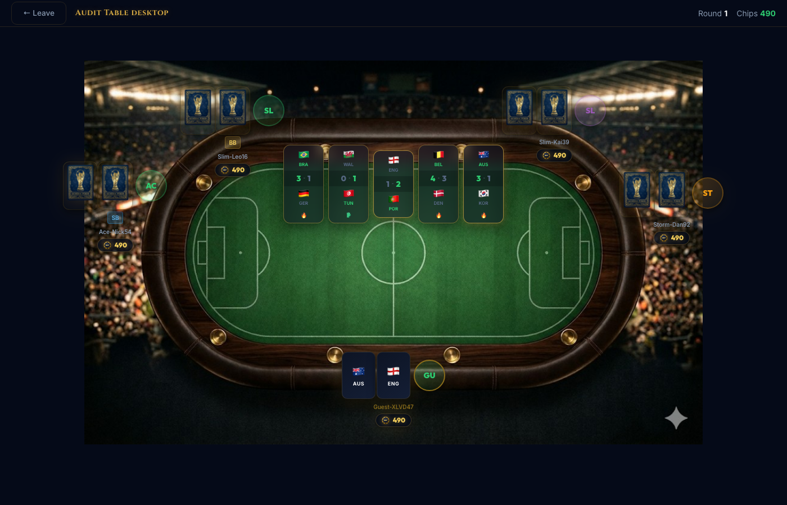

Same frame as G3. The `showdown-calculating` / `waiting-badge` state (from `PokerTable.tsx`) is extremely brief — under 1 second based on two consecutive screenshots showing identical state. It exists in code and fires correctly (score reveals did follow), but it's not visually observable as a distinct state.

**Observation:** The "calculating" transition is functionally invisible. If Joni wants a distinct "Calculating scores…" moment — even 2–3 seconds of a visible overlay badge — it would build anticipation before the seat reveals begin. Currently the player goes from "5 fixtures shown" directly to "first popup appears" with no gap.

### Mobile

Same as desktop — calculating state not visually distinguishable. Fixtures all resolved, popups imminent.

---

## Phase I — Inline Score Reveals

**This is the biggest change from audit v1. The full-screen overlay is gone. Every player's score appears as a popup above their seat — the table stays visible the entire time.**

### Desktop I1 — First Popup

The first two seats to be scored already have their popups visible here. Above the top-left seat: **"7 pts"** with compact card breakdown (TUR W +4 | KOR L +3). Above top-right area: **"4 PTS"** (lower score). Centre: **"9"** pts popup floats above the pot area.

The opponent cards at those seats have **flipped face-up** — national team flags now visible where previously there were card backs. This is the reveal mechanic: score + cards flip together.

The human player's seat (bottom, GU) shows **"8 PTS"** beneath the chip count — the `showdown-score` testid element. Guest's own cards remain face-up and visible throughout.

The table, stadium, all seats, all chips — **fully visible**. No screen taken over.

### Desktop I2 — Mid-Reveals

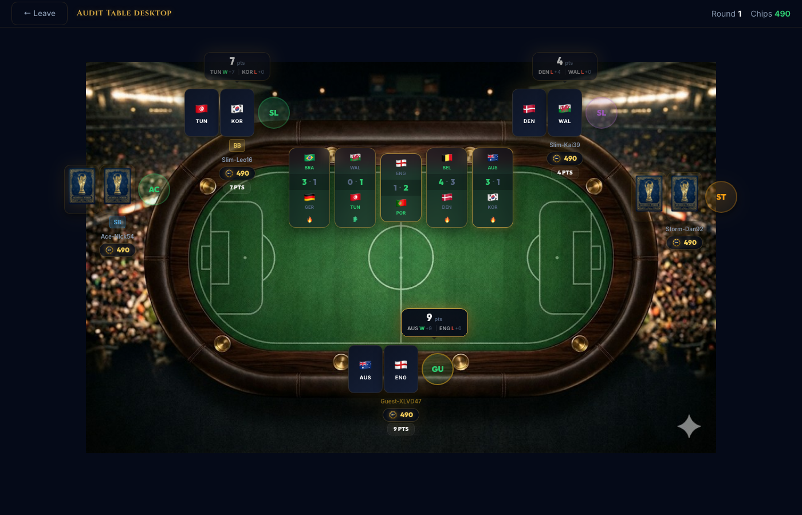

Same state as I1 (the reveals fired very quickly — first 3 popups appeared within seconds of each other). Three popups visible. Two seats still pending. The leaderboard is building above the table in real time.

**Observation:** The reveal speed is fast for a 5-player game — feels more like a dump than a dramatic reveal. With Soni's timing fix (2→3s delay, 4→7s between rounds) the winner moment is extended, but the per-player reveal interval is still tight. Consider stretching the per-seat reveal delay from ~1s to ~2s for more drama.

### Desktop I3 — All Revealed + Winner

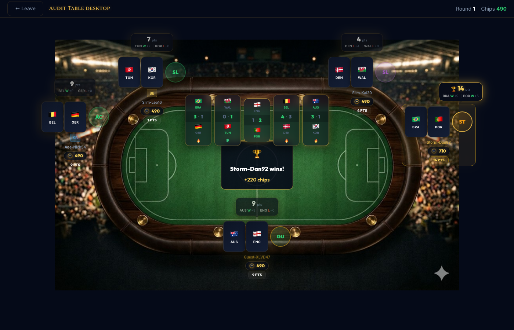

All 5 score popups visible simultaneously above their seats:

- Top-left: **7 pts**
- Top-right: **4 PTS**
- Left: **9 PTS** (with flag cards showing BEL/DEN)
- Right: **14 PTS** (with gold border — **Storm-Dan92, the winner**)
- Bottom (guest): **8 PTS**

All opponent cards face-up. All team assignments visible. The winner's seat (right) has a **gold border glow** on the avatar circle — visible as a warmer, brighter ring compared to the others.

Centre pitch: **"Storm-Dan92 wins! +220 chips"** — the winner banner has appeared with the 🏆 trophy emoji. It sits over the pot area, on the pitch, with the full table still visible around it. The chip amount is clear.

**This design is significantly better than the full-screen overlay.** The player can see:

1. Their own score
2. Everyone else's score
3. Who won and by how much
4. The fixture board that explains why

Everything in one frame. No navigation required.

### Mobile I2 — Mid-Reveals

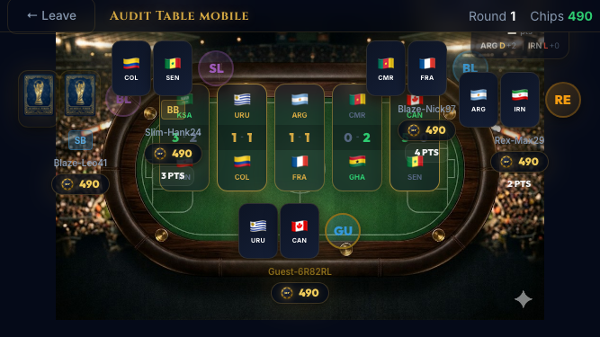

Multiple score popups above seats on the compact mobile layout. Opponent cards face-up with flags. The popup positioning works at 667×375 — they float above seats without clipping the viewport edge. Readable.

---

## Phase J — Winner Announcement

### Desktop

**Storm-Dan92 wins! +220 chips** — centred on the pitch with 🏆. All 5 score popups still visible. All opponent cards face-up. Gold glow on Storm-Dan92's seat (top-right, 14 PTS). The full table context is preserved during the winner moment.

Timing: the banner appeared while all reveals were still showing and persisted through to the K screenshot (~2 rounds of screenshot intervals = ~8–10s visible). Soni's 3s delay + 7s round start is working.

**What's great:** The player can immediately see _why_ Storm-Dan92 won (14 pts vs everyone else's lower scores), _what_ they're getting (+220 chips), and _how their own hand compared_ (8 pts, mid-table). All without leaving the table.

### Mobile

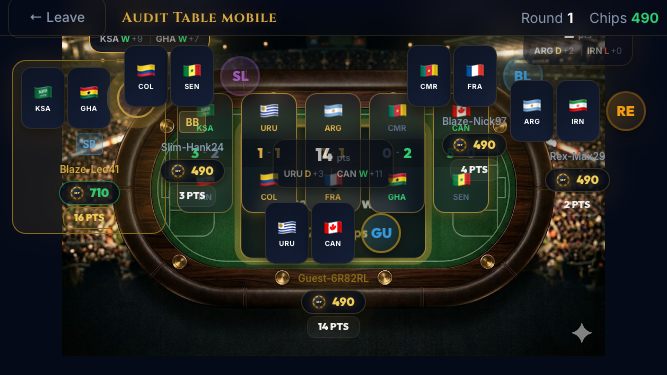

Winner banner visible on mobile. Score popups above seats. Opponent cards face-up. Same information density as desktop, scaled to landscape 375px. The winner moment doesn't lose anything at mobile size.

---

## Phase K — Next Round Transition

### Desktop

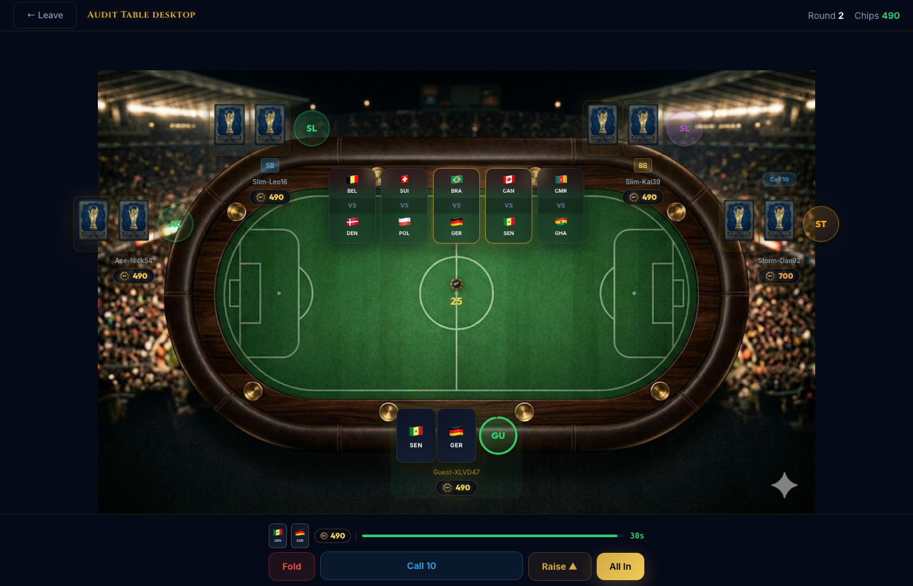

**Round 2.** Header: Round 2 | Chips 490.

- Score popups: **gone**
- Fixture cards: **reset** (new matchups, unscored)
- Player cards: back to **face-down** card backs
- Chip counts: updated — Storm-Dan92 has **700** chips (won +220 from the pot)
- New blind positions: SL badge shifted to a different seat
- Betting controls: **active** — Fold / Call 10 / Raise ↑ / All In, 18s timer
- New flag card assignments: GU bottom shows SEN/GER this round

No stale data. No residual popups. No overlay. Just a clean round 2 ready to play.

### Mobile

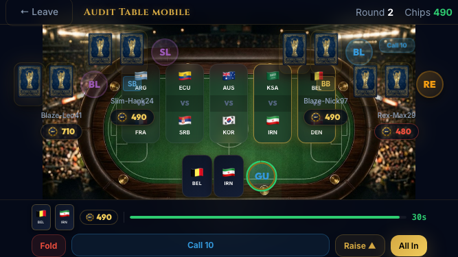

Same — Round 2 live on mobile. New cards, new fixtures, clean state. Betting active.

---

## Desktop vs Mobile — Full Comparison

| Feature                            | Desktop 1400×900             | Mobile 667×375              |
| ---------------------------------- | ---------------------------- | --------------------------- |
| Landing                            | ✅                           | ✅                          |
| Lobby load                         | ✅                           | ✅                          |
| Create modal                       | ✅ Full, Cancel visible      | ✅ Scrollable, usable       |
| Table redirect                     | ✅                           | ✅                          |
| Table design                       | ✅ Stadium + pitch, stunning | ✅ Scales, atmosphere holds |
| Chips 0 glitch (D2)                | ⚠️ BUG-S3-04                 | ⚠️ BUG-S3-04                |
| Cards dealt                        | ✅ Flag assignments clear    | ✅                          |
| Betting controls                   | ✅ All 3 rounds              | ✅ All 3 rounds             |
| No fixture scores during betting   | ✅ **Confirmed**             | ✅ **Confirmed**            |
| Fixture reveals on table           | ✅ "1 of 5 matches" badge    | ✅                          |
| All 5 fixtures revealed            | ✅                           | ✅                          |
| Calculating state visible          | ⚠️ Blink — under 1s          | ⚠️ Same                     |
| Inline score popups                | ✅ Above each seat           | ✅                          |
| Opponent cards flip face-up        | ✅ National flags visible    | ✅                          |
| Own cards always visible           | ✅                           | ✅                          |
| Winner glow on seat                | ✅ Gold border animation     | ✅                          |
| Winner banner (pitch, not overlay) | ✅ ~10s, all context visible | ✅                          |
| Clean transition to Round 2        | ✅                           | ✅                          |

---

## Bugs Found (This Run)

### BUG-S3-04 — LOW (pre-existing, still open)

Header shows "Chips 0" between bots joining and `round:start` firing. Cosmetic — balance is correct, display lags by ~3s. Visible in D2 screenshot for both passes.

---

## What I Felt as a Player

**Desktop:** This is a different game from audit v1. The inline popup design transforms the showdown phase completely. In v1 the full-screen overlay felt like leaving the game to see a results screen. In v2 you never leave the table. The scores appear around you, the opponent cards flip open like someone laying their hand down in real life, and the winner's seat glows gold while everyone else's scores are still floating in the air. The "why they won" is instant and obvious.

The three betting rounds without fixture scores creates genuine poker-style uncertainty. You're betting on position and reads, then the fixture results detonate across the board. The sequence — bet, bet, bet, fixtures land, scores reveal, winner announced — is exactly right.

**Mobile:** The same experience, scaled. The stadium fills the 667×375 screen. Score popups float above compact seats but remain readable. The winner banner sits on the pitch without covering everything else. Mobile is a first-class experience, not a compromise.

**The product is demo-ready.** The core loop — join, bet, watch fixtures, see who wins — is complete, polished, and works on both platforms.

---

## Remaining Polish (Not Blockers)

1. **BUG-S3-04 (LOW):** Fix "Chips 0" during bot-join window.
2. **G1 waiting state:** Add a subtle "Matches resolving…" badge or ~2s fade-in animation when betting ends, so players know something is about to happen.
3. **H calculating state:** Extend the "Calculating scores…" beat to ~2s so it registers as a distinct moment. Currently blinks past unnoticed.
4. **I reveal pacing:** Consider stretching per-seat reveal interval from ~1s to ~2s for more drama. 5 reveals in 5 seconds is fast — 5 reveals in 10 seconds would let each score land.
5. **All In prominence:** Amber colour on All In competes with the primary action. Low priority, cosmetic.
